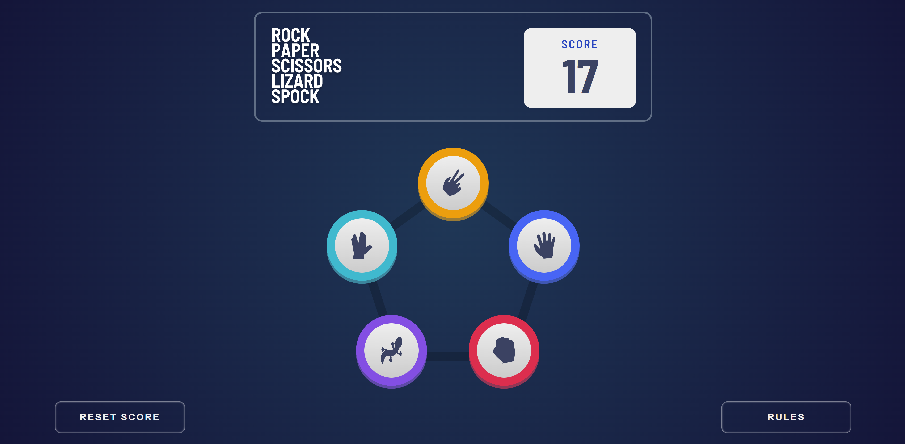
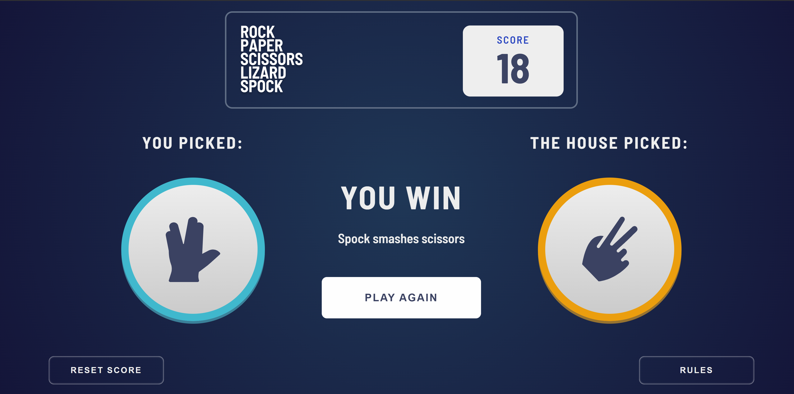
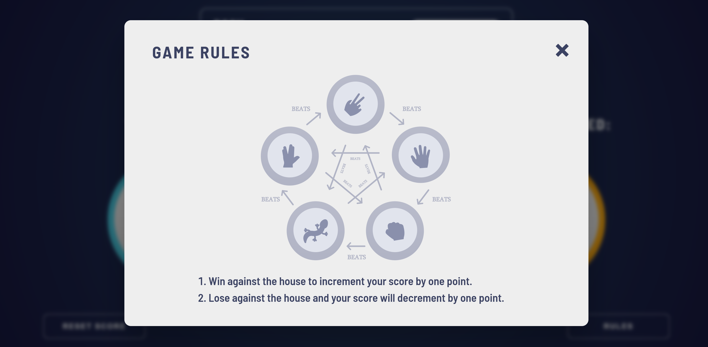
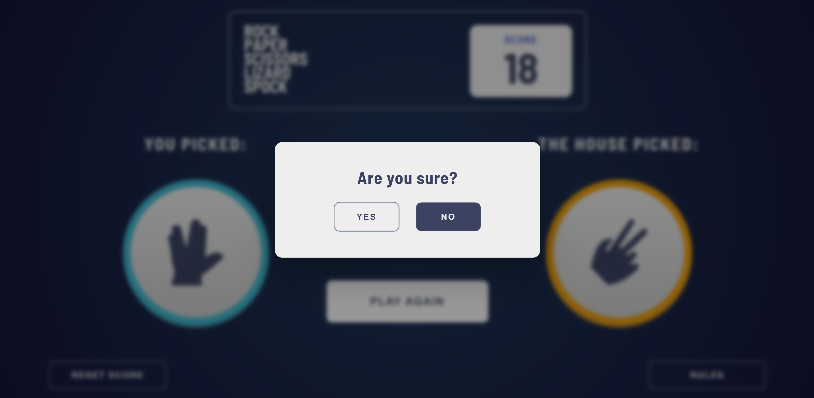
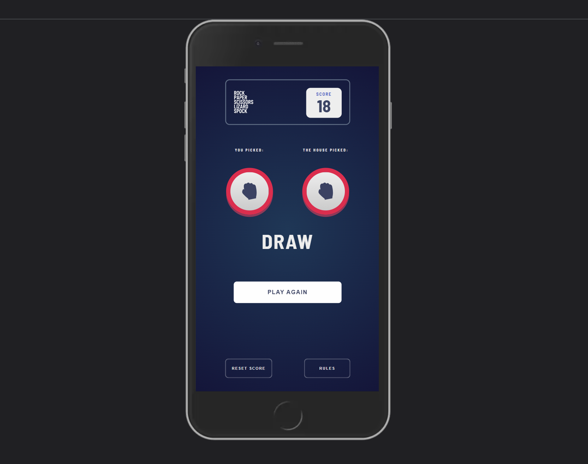

# RPSLS

'Rock, Paper, Scissors, Lizard, Spock'! The traditional game with two extra player choices originating from 'The Big Bang Theory'. Play against a computer on your mobile device or on your desktop and try to achieve a high score.

## Link

Play the game here: https://mully7773.github.io/RPSLS/

## Screenshots

 

 

 

 

## Description

This is a browser game similar to 'Rock, Paper, Scissors', but with two additional options, 'Lizard', and 'Spock'. It is a bonus challenge from Frontend Mentor, which you can learn more about [here](https://www.frontendmentor.io/challenges/rock-paper-scissors-game-pTgwgvgH). My task was to make the application function just as the original game does, but with 'Lizard' and 'Spock' choices. I made a few subtle style changes, and added both a button to reset the score and more detailed rules.

## Functionality

Upon loading the application, users are presented with a smooth UI from which they can view their current score, play buttons (choices) with corresponding icons, a reset score button, and a rule button.

The rule button opens a neat model that displays the general flow of the game along with extra details about what happens if the user wins and what happens if they lose. The general rules of the game are as follows:

Scissors beats Paper
 
Paper beats Rock
 
Rock beats Lizard
 
Lizard beats Spock
 
Spock beats Scissors
 
Scissors beats Lizard
 
Lizard beats Paper
 
Paper beats Spock
 
Spock beats Rock
 
Rock beats Scissors

Users select one of the button on the home screen after which they are presented with a face off. Their selection fades in followed by the computer's randomized selection. Then, the results are displayed along with a message that explains why they won or lost (this message is taken from 'The Big Bang Theory'). If the user wins against the computer, their score increments by one point, otherwise it decreases by one point. Finally, a play again button can be found beneath the message, so users can return to the home screen and play again. Users will notice that their score is always saved even after exiting the browser and returning later. I felt it would be helpful to allow the user to reset their score in case of a particularly bad streak of losses, or if a different user on the same device wishes to play the game.

This game is mobile responsive and is supported on desktops and mobile devices. I've personally tested it on later models of the iPhone and played it successfully.

## Technology

In terms of programming, I implemented the MVC architecture for extra practice. Although it was a challenge determining where the data, or more specifically, where the user data would would be stored, I felt this architecture lent itself fairly well to the aims of this project, and will make future implementations easier to incorporate. In the future, I think it would be fun to provide users with the option to play the traditional 'Rock, Paper, Scissors' game as well.

HTML
 
CSS
 
JavaScript
 
MVC architecture
 
Mobile responsiveness

## Questions:

Feel free to contact me at mully7773@gmail.com if you have any questions.  
You can view more of my projects at https://github.com/Mully7773.
